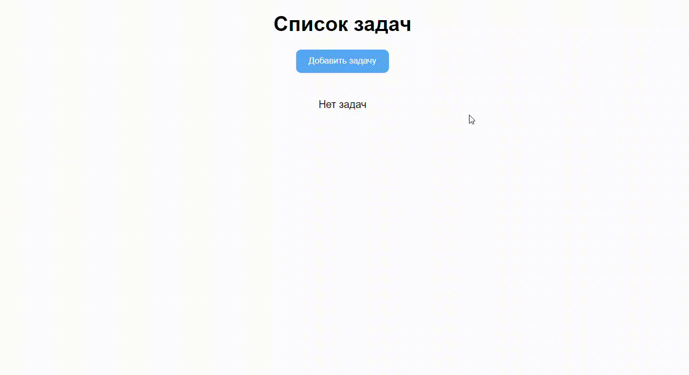

# todolist


### Stack
+ JavaScript
+ Observer on-change
+ yup
+ webpack
+ less
+ NodeJs
+ json-server
### Installation
1) Open terminal
2) On command line, type in the following commands:
```console
$ cd server
```
3) Install packages:
```console
$ npm install
```
4) Start application:
```console
$ npm server
```
5) Open terminal
6) On command line, type in the following commands:
```console
$ cd client
```
7) Install packages:
```console
$ npm install
```
7) Start application:
```console
$ npm dev
```
